# Equipment Inventory Management System

A comprehensive web-based inventory management system for tracking equipment, devices, and assets within an organization using **MySQLi** for database operations.

## 📋 Table of Contents

- [Features](#-features)
- [System Screenshots](#-system-screenshots)
- [File Structure](#-file-structure)
- [Installation](#-installation)
- [Database Schema](#-database-schema)
- [MySQLi Connection Examples](#-mysqli-connection-examples)
- [Usage Guide](#-usage-guide)
- [Technical Details](#-technical-details)
- [Security Features](#-security-features)
- [Troubleshooting](#-troubleshooting)
- [Future Enhancements](#-future-enhancements)
- [Contributing](#-contributing)
- [License](#-license)

---

## 🖥️ System Screenshots

Here's a visual tour of the Equipment Inventory Management System:

### Dashboard Overview

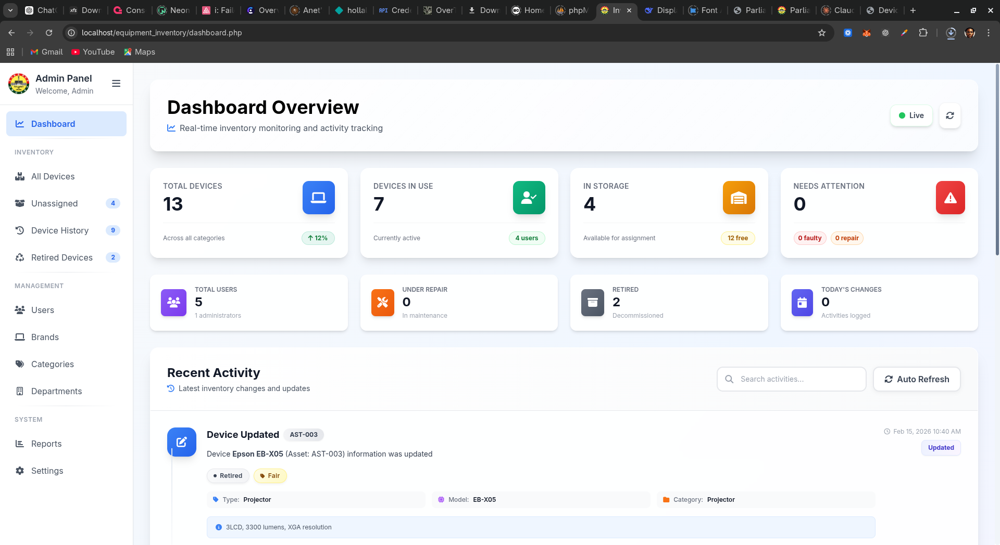
_Real-time inventory monitoring and activity tracking dashboard with key metrics and recent activity_

### Inventory Management

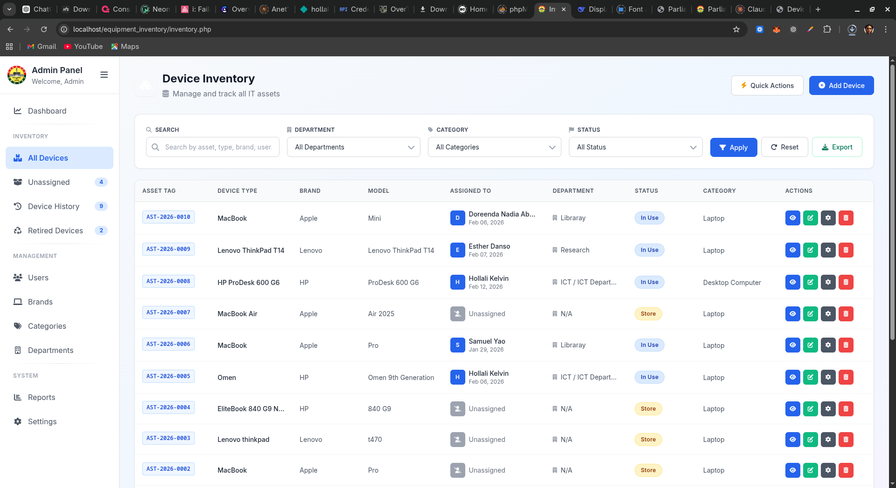
_Complete inventory listing with quick actions, filtering capabilities, and device management_

### Unassigned & Stored Devices

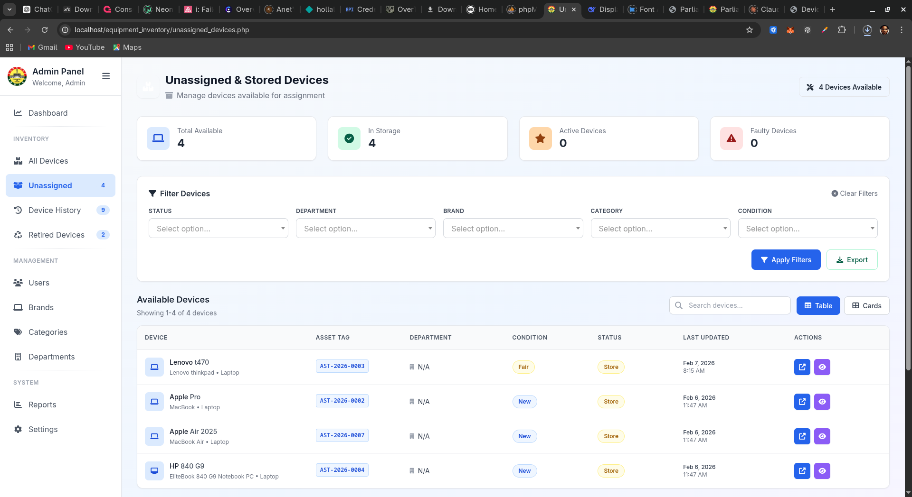
_Manage devices available for assignment with detailed filtering options_

### Device Assignment History

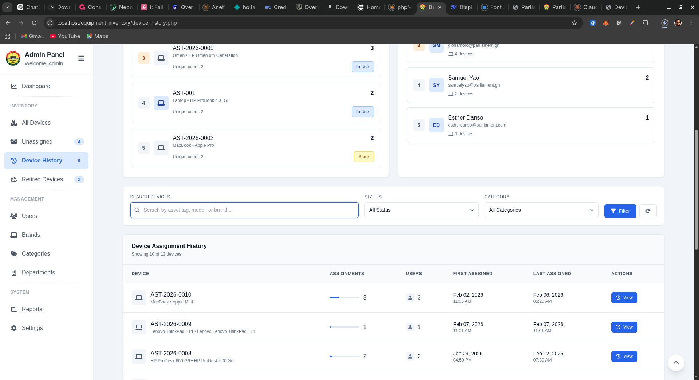
_Track the complete lifecycle and assignment history of all devices_

### Retired Devices Archive

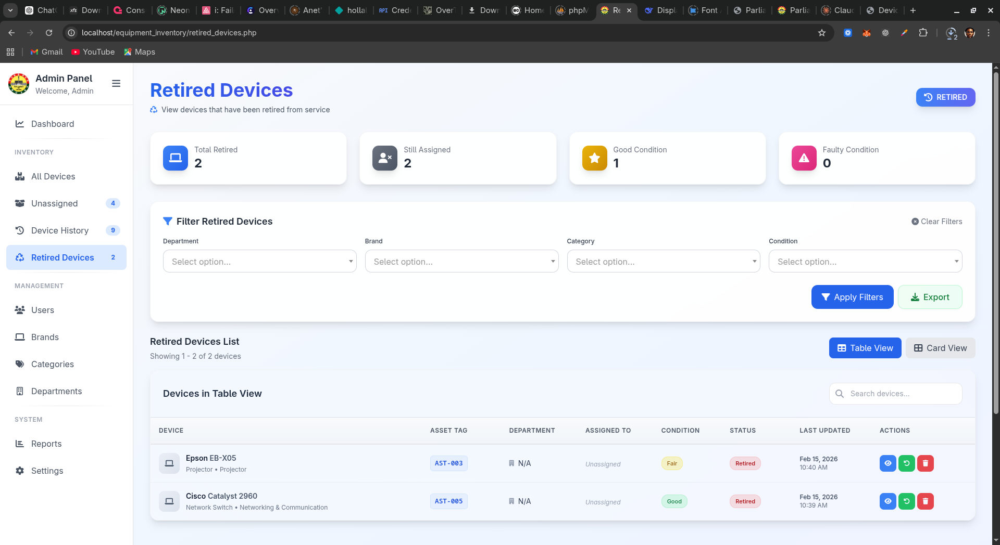
_Dedicated archive for decommissioned equipment with complete history_

### User Management

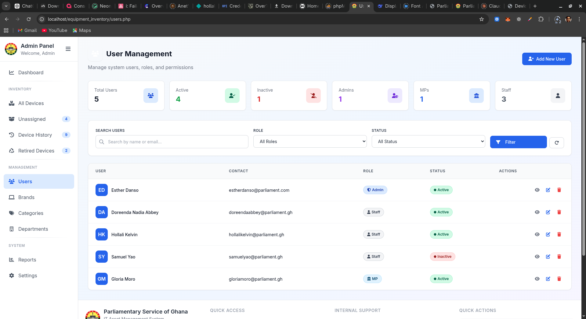
_Manage system users, roles, permissions, and access levels_

### Brand Management

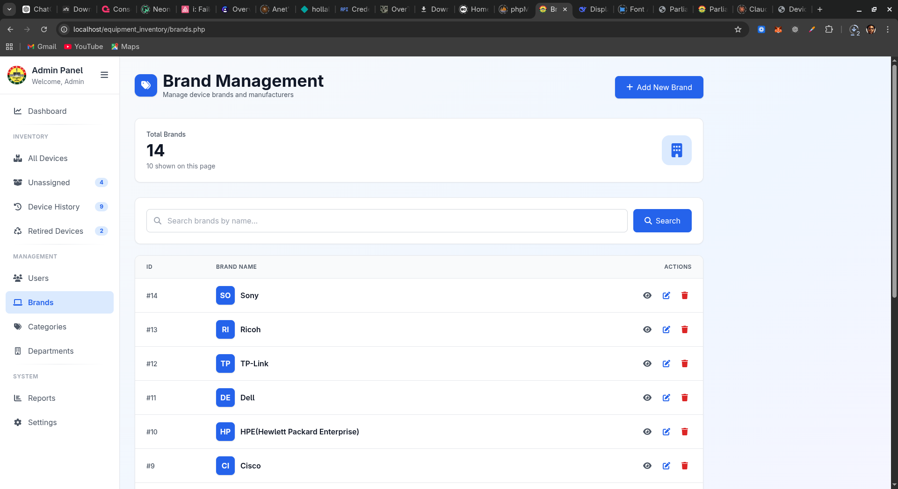
_Manage device brands and manufacturers with easy CRUD operations_

### Categories Management

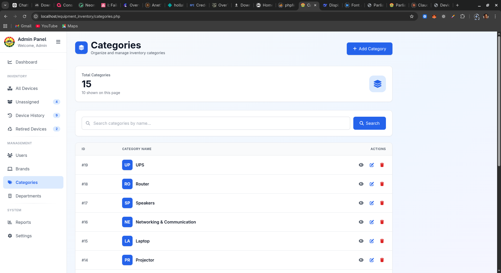
_Organize inventory by categories for better classification_

### Departments Management

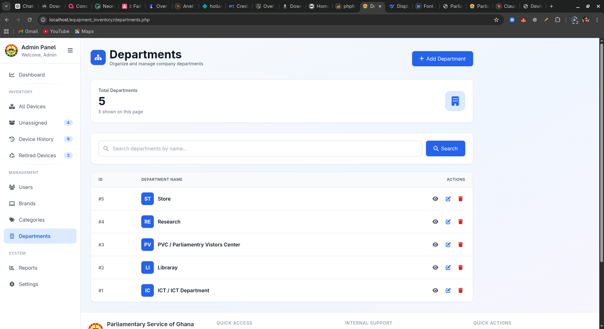
_Organize and manage company departments for device assignment_

### System Analytics

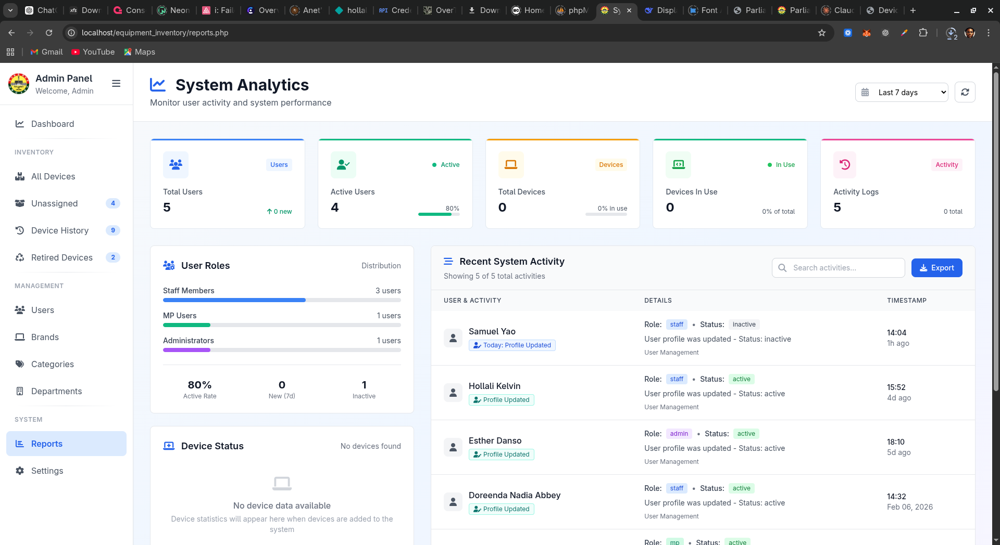
_Monitor user activity, system performance, and role distribution_

### System Settings

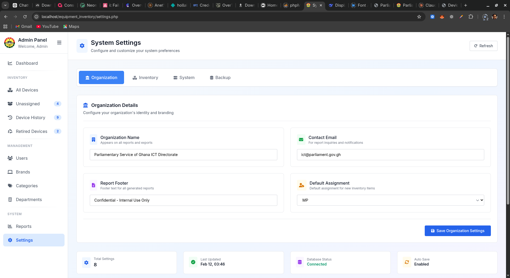
_Configure system preferences, organization details, and backup options_

---

## 📋 Features

### 🏷️ Core Inventory Management

- **Device Tracking**: Track all equipment with detailed information including asset tag, brand, model, and specifications
- **Status Management**: Monitor device status (`In Use`, `Store`, `Faulty`, `Retired`)
- **Condition Tracking**: Track device condition (`New`, `Good`, `Fair`, `Faulty`)
- **Assignment System**: Assign devices to users and departments with complete history logging
- **Location Tracking**: Monitor device locations across the organization via department assignment

### 👥 User & Department Management

- **User Management**: Add, edit, and manage system users with email and roles
- **Department Management**: Organize devices by departments (ICT, Library, Research, etc.)
- **Role-based Access**: Pre-defined user roles (Admin, Staff, MP) with varying permissions
- **Active/Inactive Status**: Control user access to the system by toggling their status

### 🔧 Device Categories & Brands

- **Category Management**: Organize devices by type (Laptops, Projectors, Networking Equipment)
- **Brand Management**: Track device manufacturers (Apple, HP, Dell, Cisco, etc.)
- **Custom Categories**: Create and manage custom categories and sub-categories

### 📊 Reporting & Analytics

- **Dashboard**: High-level overview of inventory statistics (total devices, in use, in storage)
- **System Analytics**: Monitor user activity, active users, and role distribution
- **Device History**: Complete assignment history and lifecycle tracking for each device
- **Retired Devices**: Dedicated archive for decommissioned equipment
- **Export Functionality**: Export filtered data (devices, users, history) to CSV format

### 🔍 Search & Filters

- **Global Search**: Search across all device attributes (asset tag, model, brand)
- **Advanced Filtering**: Multi-criteria filtering by status, department, brand, category, and condition
- **Smart Suggestions**: Real-time search suggestions as you type

### 📱 User Interface

- **Responsive Design**: Fully functional on desktops, tablets, and mobile phones
- **Dual View Mode**: Toggle between detailed table view and visual card view for devices
- **Modal Forms**: Clean, modern modal-based forms for all add/edit actions
- **Toast Notifications**: User-friendly feedback messages for all operations
- **Interactive Elements**: Hover effects, smooth animations, and visual feedback

---

## 📁 File Structure

```
equipment_inventory/
├── ajax/                          # AJAX handlers for real-time operations
│   ├── get_device_details.php     # Fetch device details for assignments
│   ├── search_devices.php         # Live search functionality
│   └── update_device_status.php   # Quick status updates
│
├── config/                        # Configuration files
│   ├── database.php               # MySQLi database connection settings
│   ├── database.example.php       # Example configuration template
│   └── database.sql               # Database schema dump
│
├── images/                         # Static images and screenshots
│   ├── 01-dashboard-overview.png
│   ├── 02-inventory-view.png
│   ├── 03-unassigned-devices.png
│   ├── 04-device-history.png
│   ├── 05-retired-devices.png
│   ├── 06-user-management.png
│   ├── 07-brand-management.png
│   ├── 08-categories.png
│   ├── 09-departments.png
│   ├── 10-system-analytics.png
│   └── 11-system-settings.png
│
├── includes/                       # Reusable PHP components
│   ├── auth.php                    # Authentication functions
│   ├── functions.php               # Helper functions
│   └── validation.php              # Input validation functions
│
├── brands.php                      # Brand management page
├── categories.php                  # Category management page
├── dashboard.php                   # Main dashboard with key metrics
├── departments.php                 # Department management page
├── device_history.php              # Device assignment history view
├── export_assignments.php          # Export assignments data to CSV
├── export_device_history.php       # Export device history to CSV
├── export_unassigned.php           # Export unassigned devices to CSV
├── export_users.php                # Export users data to CSV
├── footer.php                      # Site footer with common scripts
├── header.php                      # Site header with navigation
├── inventory.php                   # Main inventory management
├── login.php                       # User authentication page
├── logout.php                      # Logout handler
├── process_assign.php              # Backend handler for device assignments
├── reports.php                     # Reports and analytics center
├── retired_devices.php             # Retired devices archive
├── search_suggestions.php          # Endpoint for live search suggestions
├── settings.php                    # System settings configuration
├── sidebar.php                     # Persistent navigation sidebar
├── unassigned_devices.php          # Unassigned devices management
├── users.php                       # User management page
├── README.md                       # This documentation file
└── .gitignore                      # Git ignore rules
```

---

## 🚀 Installation

### Prerequisites

| Requirement | Version                       |
| ----------- | ----------------------------- |
| PHP         | 7.4 or higher                 |
| MySQL       | 5.7 or higher                 |
| Web Server  | Apache/Nginx                  |
| Browser     | Chrome, Firefox, Safari, Edge |

### Step-by-Step Installation

1. **Clone or download the project**

   ```bash
   git clone https://github.com/yourusername/equipment-inventory-system.git
   cd equipment_inventory
   ```

2. **Create MySQL database**

   ```sql
   CREATE DATABASE equipment_inventory_db CHARACTER SET utf8mb4 COLLATE utf8mb4_unicode_ci;
   ```

3. **Import database schema**

   ```bash
   # Using MySQL command line
   mysql -u your_username -p equipment_inventory_db < config/database.sql

   # Or import via phpMyAdmin
   # - Open phpMyAdmin
   # - Select your database
   # - Click Import
   # - Choose config/database.sql
   ```

4. **Configure database connection**

   ```bash
   # Copy the example configuration
   cp config/database.example.php config/database.php

   # Edit the file with your database credentials
   nano config/database.php
   ```

   ```php
   <?php
   // config/database.php - MySQLi version
   define('DB_HOST', 'localhost');
   define('DB_USER', 'your_username');
   define('DB_PASSWORD', 'your_password');
   define('DB_NAME', 'equipment_inventory_db');
   define('DB_PORT', 3306); // Default MySQL port

   // Create connection
   $conn = mysqli_connect(DB_HOST, DB_USER, DB_PASSWORD, DB_NAME, DB_PORT);

   // Check connection
   if (mysqli_connect_errno()) {
       die("Database connection failed: " . mysqli_connect_error());
   }

   // Set charset to UTF-8
   mysqli_set_charset($conn, "utf8mb4");

   // Set timezone
   date_default_timezone_set('Africa/Accra');
   ```

5. **Set proper permissions**

   ```bash
   # For Linux/Unix systems
   chmod 755 -R equipment_inventory/
   chmod 644 equipment_inventory/config/database.php
   ```

6. **Create default admin user**

   ```sql
   INSERT INTO users (name, email, password, role, status, created_at)
   VALUES ('Administrator', 'admin@parliament.gov.gh', MD5('Admin@123'), 'Admin', 'Active', NOW());
   ```

   > **Note**: Change the password after first login!

7. **Access the system**
   - Open your browser and navigate to: `http://localhost/equipment_inventory/`
   - Login with:
     - Email: `admin@parliament.gov.gh`
     - Password: `Admin@123`

---

## 🗄️ Database Schema

### Entity Relationship Diagram

```
+----------------+       +----------------------+       +---------------+
|    brands      |       |   inventory_items    |       |   categories  |
+----------------+       +----------------------+       +---------------+
| id (PK)        |<------| brand_id             |       | id (PK)       |
| name           |       | category_id          |------>| name          |
| created_at     |       | id (PK)              |       | created_at    |
+----------------+       | asset_tag (unique)   |       +---------------+
                         | device_type          |
+----------------+       | model                |       +---------------+
|   users        |       | specifications       |       |  departments  |
+----------------+       | condition            |       +---------------+
| id (PK)        |       | status               |       | id (PK)       |
| name           |       | location             |       | name          |
| email (unique) |<------| assigned_user_id     |       | code          |
| password       |       | department_id        |------>| created_at    |
| role           |       | purchase_date        |       +---------------+
| status         |       | warranty_expiry      |
| created_at     |       | remarks              |
+----------------+       | created_at           |
                         | updated_at           |
                         +----------------------+
                                  |
                                  |
                         +--------v--------+
                         | device_assignments (History)
                         +-----------------+
                         | id (PK)         |
                         | device_id (FK)  |
                         | user_id (FK)    |
                         | department_id   |
                         | assigned_by     |
                         | assigned_date   |
                         | returned_date   |
                         | remarks         |
                         +-----------------+
```

### Table Definitions

#### 1. **users** - System users

```sql
CREATE TABLE users (
    id INT AUTO_INCREMENT PRIMARY KEY,
    name VARCHAR(100) NOT NULL,
    email VARCHAR(100) UNIQUE NOT NULL,
    password VARCHAR(255) NOT NULL,
    role ENUM('Admin', 'Staff', 'MP') DEFAULT 'Staff',
    status ENUM('Active', 'Inactive') DEFAULT 'Active',
    created_at TIMESTAMP DEFAULT CURRENT_TIMESTAMP,
    updated_at TIMESTAMP DEFAULT CURRENT_TIMESTAMP ON UPDATE CURRENT_TIMESTAMP,
    INDEX idx_email (email),
    INDEX idx_status (status)
) ENGINE=InnoDB DEFAULT CHARSET=utf8mb4;
```

#### 2. **brands** - Device manufacturers

```sql
CREATE TABLE brands (
    id INT AUTO_INCREMENT PRIMARY KEY,
    name VARCHAR(100) UNIQUE NOT NULL,
    created_at TIMESTAMP DEFAULT CURRENT_TIMESTAMP,
    INDEX idx_name (name)
) ENGINE=InnoDB DEFAULT CHARSET=utf8mb4;
```

#### 3. **categories** - Device categories

```sql
CREATE TABLE categories (
    id INT AUTO_INCREMENT PRIMARY KEY,
    name VARCHAR(100) UNIQUE NOT NULL,
    code VARCHAR(10) GENERATED ALWAYS AS
        (CONCAT(UPPER(LEFT(name, 2)), id)) STORED,
    created_at TIMESTAMP DEFAULT CURRENT_TIMESTAMP,
    INDEX idx_name (name)
) ENGINE=InnoDB DEFAULT CHARSET=utf8mb4;
```

#### 4. **departments** - Organization departments

```sql
CREATE TABLE departments (
    id INT AUTO_INCREMENT PRIMARY KEY,
    name VARCHAR(100) UNIQUE NOT NULL,
    code VARCHAR(10) GENERATED ALWAYS AS
        (CONCAT(UPPER(LEFT(name, 2)), id)) STORED,
    created_at TIMESTAMP DEFAULT CURRENT_TIMESTAMP,
    INDEX idx_name (name)
) ENGINE=InnoDB DEFAULT CHARSET=utf8mb4;
```

#### 5. **inventory_items** - Core device inventory

```sql
CREATE TABLE inventory_items (
    id INT AUTO_INCREMENT PRIMARY KEY,
    asset_tag VARCHAR(50) UNIQUE NOT NULL,
    device_type VARCHAR(100),
    brand_id INT,
    model VARCHAR(100),
    specifications TEXT,
    category_id INT,
    department_id INT,
    assigned_user_id INT,
    location VARCHAR(100),
    condition ENUM('New', 'Good', 'Fair', 'Faulty') DEFAULT 'Good',
    status ENUM('In Use', 'Store', 'Faulty', 'Retired') DEFAULT 'Store',
    purchase_date DATE,
    warranty_expiry DATE,
    remarks TEXT,
    created_at TIMESTAMP DEFAULT CURRENT_TIMESTAMP,
    updated_at TIMESTAMP DEFAULT CURRENT_TIMESTAMP ON UPDATE CURRENT_TIMESTAMP,
    FOREIGN KEY (brand_id) REFERENCES brands(id) ON DELETE SET NULL,
    FOREIGN KEY (category_id) REFERENCES categories(id) ON DELETE SET NULL,
    FOREIGN KEY (department_id) REFERENCES departments(id) ON DELETE SET NULL,
    FOREIGN KEY (assigned_user_id) REFERENCES users(id) ON DELETE SET NULL,
    INDEX idx_asset_tag (asset_tag),
    INDEX idx_status (status),
    INDEX idx_condition (condition),
    INDEX idx_department (department_id),
    INDEX idx_assigned_user (assigned_user_id),
    FULLTEXT INDEX idx_search (asset_tag, model, specifications)
) ENGINE=InnoDB DEFAULT CHARSET=utf8mb4;
```

#### 6. **device_assignments** - Assignment history

```sql
CREATE TABLE device_assignments (
    id INT AUTO_INCREMENT PRIMARY KEY,
    device_id INT NOT NULL,
    user_id INT,
    department_id INT,
    assigned_by INT,
    assigned_date TIMESTAMP DEFAULT CURRENT_TIMESTAMP,
    returned_date TIMESTAMP NULL,
    remarks TEXT,
    FOREIGN KEY (device_id) REFERENCES inventory_items(id) ON DELETE CASCADE,
    FOREIGN KEY (user_id) REFERENCES users(id) ON DELETE SET NULL,
    FOREIGN KEY (department_id) REFERENCES departments(id) ON DELETE SET NULL,
    FOREIGN KEY (assigned_by) REFERENCES users(id) ON DELETE SET NULL,
    INDEX idx_device (device_id),
    INDEX idx_user (user_id),
    INDEX idx_dates (assigned_date, returned_date)
) ENGINE=InnoDB DEFAULT CHARSET=utf8mb4;
```

---

## 🔌 MySQLi Connection Examples

### 1. **Basic Database Connection**

```php
<?php
// config/database.php
$host = 'localhost';
$user = 'root';
$password = '';
$database = 'equipment_inventory_db';

// Create connection
$conn = mysqli_connect($host, $user, $password, $database);

// Check connection
if (!$conn) {
    die("Connection failed: " . mysqli_connect_error());
}

// Set charset
mysqli_set_charset($conn, "utf8mb4");
?>
```

### 2. **Reusable Connection Function**

```php
<?php
// includes/db_functions.php
function getDbConnection() {
    static $conn = null;

    if ($conn === null) {
        $host = 'localhost';
        $user = 'root';
        $password = '';
        $database = 'equipment_inventory_db';

        $conn = mysqli_connect($host, $user, $password, $database);

        if (!$conn) {
            error_log("Database connection failed: " . mysqli_connect_error());
            return false;
        }

        mysqli_set_charset($conn, "utf8mb4");
    }

    return $conn;
}
?>
```

### 3. **SELECT Query with MySQLi (Procedural)**

```php
<?php
// Get all active devices
$conn = mysqli_connect(DB_HOST, DB_USER, DB_PASSWORD, DB_NAME);

$sql = "SELECT * FROM inventory_items WHERE status = 'In Use' ORDER BY created_at DESC";
$result = mysqli_query($conn, $sql);

if (mysqli_num_rows($result) > 0) {
    while ($row = mysqli_fetch_assoc($result)) {
        echo "Device: " . $row['asset_tag'] . " - " . $row['model'] . "<br>";
    }
} else {
    echo "No devices found";
}

mysqli_close($conn);
?>
```

### 4. **SELECT Query with Prepared Statement (Secure)**

```php
<?php
// Get devices by department with prepared statement
$conn = mysqli_connect(DB_HOST, DB_USER, DB_PASSWORD, DB_NAME);
$dept_id = 3;

$sql = "SELECT * FROM inventory_items WHERE department_id = ? AND status = ?";
$stmt = mysqli_prepare($conn, $sql);

// Bind parameters
mysqli_stmt_bind_param($stmt, "is", $dept_id, $status);
$status = "In Use";

// Execute query
mysqli_stmt_execute($stmt);

// Get result
$result = mysqli_stmt_get_result($stmt);

while ($row = mysqli_fetch_assoc($result)) {
    echo $row['asset_tag'] . " - " . $row['model'] . "<br>";
}

// Close statement
mysqli_stmt_close($stmt);
mysqli_close($conn);
?>
```

### 5. **INSERT Query with Prepared Statement**

```php
<?php
// Add new device
$conn = mysqli_connect(DB_HOST, DB_USER, DB_PASSWORD, DB_NAME);

$sql = "INSERT INTO inventory_items (asset_tag, brand_id, model, category_id, condition, status)
        VALUES (?, ?, ?, ?, ?, ?)";

$stmt = mysqli_prepare($conn, $sql);

// Bind parameters
mysqli_stmt_bind_param($stmt, "sisiss",
    $asset_tag,
    $brand_id,
    $model,
    $category_id,
    $condition,
    $status
);

// Set parameters
$asset_tag = "AST-2026-0012";
$brand_id = 1;
$model = "MacBook Pro 16";
$category_id = 15;
$condition = "New";
$status = "Store";

// Execute
if (mysqli_stmt_execute($stmt)) {
    $new_id = mysqli_insert_id($conn);
    echo "New device added with ID: " . $new_id;
} else {
    echo "Error: " . mysqli_error($conn);
}

mysqli_stmt_close($stmt);
mysqli_close($conn);
?>
```

### 6. **UPDATE Query with Prepared Statement**

```php
<?php
// Update device status
$conn = mysqli_connect(DB_HOST, DB_USER, DB_PASSWORD, DB_NAME);

$sql = "UPDATE inventory_items SET status = ?, condition = ? WHERE asset_tag = ?";
$stmt = mysqli_prepare($conn, $sql);

mysqli_stmt_bind_param($stmt, "sss", $status, $condition, $asset_tag);

$status = "In Use";
$condition = "Good";
$asset_tag = "AST-2026-0010";

if (mysqli_stmt_execute($stmt)) {
    echo mysqli_affected_rows($conn) . " record updated successfully";
}

mysqli_stmt_close($stmt);
mysqli_close($conn);
?>
```

### 7. **DELETE Query with Prepared Statement**

```php
<?php
// Delete retired device (soft delete usually better)
$conn = mysqli_connect(DB_HOST, DB_USER, DB_PASSWORD, DB_NAME);

$sql = "DELETE FROM inventory_items WHERE id = ? AND status = 'Retired'";
$stmt = mysqli_prepare($conn, $sql);

mysqli_stmt_bind_param($stmt, "i", $device_id);
$device_id = 5;

if (mysqli_stmt_execute($stmt)) {
    echo "Device deleted successfully";
}

mysqli_stmt_close($stmt);
mysqli_close($conn);
?>
```

### 8. **Transaction Example with MySQLi**

```php
<?php
// Assign device with transaction
$conn = mysqli_connect(DB_HOST, DB_USER, DB_PASSWORD, DB_NAME);

// Start transaction
mysqli_begin_transaction($conn);

try {
    // Update device status
    $sql1 = "UPDATE inventory_items SET assigned_user_id = ?, status = 'In Use' WHERE id = ?";
    $stmt1 = mysqli_prepare($conn, $sql1);
    mysqli_stmt_bind_param($stmt1, "ii", $user_id, $device_id);
    mysqli_stmt_execute($stmt1);

    // Log assignment
    $sql2 = "INSERT INTO device_assignments (device_id, user_id, assigned_by, remarks) VALUES (?, ?, ?, ?)";
    $stmt2 = mysqli_prepare($conn, $sql2);
    mysqli_stmt_bind_param($stmt2, "iiis", $device_id, $user_id, $assigned_by, $remarks);
    mysqli_stmt_execute($stmt2);

    // Commit transaction
    mysqli_commit($conn);
    echo "Device assigned successfully";

} catch (Exception $e) {
    // Rollback on error
    mysqli_rollback($conn);
    echo "Failed to assign device: " . $e->getMessage();
}

mysqli_close($conn);
?>
```

### 9. **Search Function with Multiple Conditions**

```php
<?php
// Search devices with multiple filters
function searchDevices($search_term, $status = '', $department_id = '') {
    $conn = getDbConnection();

    $sql = "SELECT i.*, b.name as brand_name, d.name as dept_name, u.name as user_name
            FROM inventory_items i
            LEFT JOIN brands b ON i.brand_id = b.id
            LEFT JOIN departments d ON i.department_id = d.id
            LEFT JOIN users u ON i.assigned_user_id = u.id
            WHERE (i.asset_tag LIKE ? OR i.model LIKE ? OR i.specifications LIKE ?)";

    $params = ["%$search_term%", "%$search_term%", "%$search_term%"];
    $types = "sss";

    if (!empty($status)) {
        $sql .= " AND i.status = ?";
        $params[] = $status;
        $types .= "s";
    }

    if (!empty($department_id)) {
        $sql .= " AND i.department_id = ?";
        $params[] = $department_id;
        $types .= "i";
    }

    $sql .= " ORDER BY i.created_at DESC";

    $stmt = mysqli_prepare($conn, $sql);
    mysqli_stmt_bind_param($stmt, $types, ...$params);
    mysqli_stmt_execute($stmt);

    return mysqli_stmt_get_result($stmt);
}

// Usage
$results = searchDevices("MacBook", "In Use", 3);
while ($device = mysqli_fetch_assoc($results)) {
    echo $device['asset_tag'] . " - " . $device['brand_name'] . " " . $device['model'] . "<br>";
}
?>
```

### 10. **Helper Functions for Common Operations**

```php
<?php
// includes/functions.php

// Get single record
function getRecord($table, $id) {
    $conn = getDbConnection();
    $sql = "SELECT * FROM $table WHERE id = ?";
    $stmt = mysqli_prepare($conn, $sql);
    mysqli_stmt_bind_param($stmt, "i", $id);
    mysqli_stmt_execute($stmt);
    $result = mysqli_stmt_get_result($stmt);
    return mysqli_fetch_assoc($result);
}

// Get all records
function getAllRecords($table, $order_by = 'created_at', $order_dir = 'DESC') {
    $conn = getDbConnection();
    $sql = "SELECT * FROM $table ORDER BY $order_by $order_dir";
    $result = mysqli_query($conn, $sql);
    $data = [];
    while ($row = mysqli_fetch_assoc($result)) {
        $data[] = $row;
    }
    return $data;
}

// Count records
function countRecords($table, $condition = '') {
    $conn = getDbConnection();
    $sql = "SELECT COUNT(*) as total FROM $table";
    if (!empty($condition)) {
        $sql .= " WHERE " . $condition;
    }
    $result = mysqli_query($conn, $sql);
    $row = mysqli_fetch_assoc($result);
    return $row['total'];
}

// Check if record exists
function recordExists($table, $field, $value) {
    $conn = getDbConnection();
    $sql = "SELECT id FROM $table WHERE $field = ? LIMIT 1";
    $stmt = mysqli_prepare($conn, $sql);
    mysqli_stmt_bind_param($stmt, "s", $value);
    mysqli_stmt_execute($stmt);
    mysqli_stmt_store_result($stmt);
    return mysqli_stmt_num_rows($stmt) > 0;
}
?>
```

---

## 📈 Usage Guide

### Quick Start Guide

#### 1. **Adding Your First Device**

```php
<?php
// Example code for adding a device
require_once 'config/database.php';

if ($_SERVER['REQUEST_METHOD'] == 'POST') {
    $asset_tag = mysqli_real_escape_string($conn, $_POST['asset_tag']);
    $brand_id = (int)$_POST['brand_id'];
    $model = mysqli_real_escape_string($conn, $_POST['model']);

    $sql = "INSERT INTO inventory_items (asset_tag, brand_id, model, status)
            VALUES ('$asset_tag', $brand_id, '$model', 'Store')";

    if (mysqli_query($conn, $sql)) {
        $_SESSION['success'] = "Device added successfully";
        header("Location: inventory.php");
    } else {
        $error = "Error: " . mysqli_error($conn);
    }
}
?>
```

#### 2. **Assigning a Device to a User**

```php
<?php
// process_assign.php - MySQLi version
require_once 'config/database.php';
session_start();

if ($_SERVER['REQUEST_METHOD'] == 'POST') {
    $device_id = mysqli_real_escape_string($conn, $_POST['device_id']);
    $user_id = mysqli_real_escape_string($conn, $_POST['user_id']);
    $assigned_by = $_SESSION['user_id'];

    // Start transaction
    mysqli_begin_transaction($conn);

    // Update device
    $sql1 = "UPDATE inventory_items SET
             assigned_user_id = $user_id,
             status = 'In Use'
             WHERE id = $device_id";

    if (mysqli_query($conn, $sql1)) {
        // Log assignment
        $sql2 = "INSERT INTO device_assignments
                 (device_id, user_id, assigned_by)
                 VALUES ($device_id, $user_id, $assigned_by)";

        if (mysqli_query($conn, $sql2)) {
            mysqli_commit($conn);
            echo json_encode(['success' => true]);
        } else {
            mysqli_rollback($conn);
            echo json_encode(['error' => 'Failed to log assignment']);
        }
    } else {
        mysqli_rollback($conn);
        echo json_encode(['error' => 'Failed to update device']);
    }
}
?>
```

#### 3. **Dashboard Statistics**

```php
<?php
// dashboard.php - Get statistics
require_once 'config/database.php';

// Total devices
$result = mysqli_query($conn, "SELECT COUNT(*) as total FROM inventory_items");
$total_devices = mysqli_fetch_assoc($result)['total'];

// Devices in use
$result = mysqli_query($conn, "SELECT COUNT(*) as total FROM inventory_items WHERE status = 'In Use'");
$in_use = mysqli_fetch_assoc($result)['total'];

// Devices in storage
$result = mysqli_query($conn, "SELECT COUNT(*) as total FROM inventory_items WHERE status = 'Store'");
$in_storage = mysqli_fetch_assoc($result)['total'];

// Retired devices
$result = mysqli_query($conn, "SELECT COUNT(*) as total FROM inventory_items WHERE status = 'Retired'");
$retired = mysqli_fetch_assoc($result)['total'];

// Total users
$result = mysqli_query($conn, "SELECT COUNT(*) as total FROM users WHERE status = 'Active'");
$active_users = mysqli_fetch_assoc($result)['total'];
?>
```

---

## 🛠️ Technical Details

### Technology Stack

| Layer                  | Technology              | Purpose                     |
| ---------------------- | ----------------------- | --------------------------- |
| **Frontend**           | HTML5, CSS3, JavaScript | Structure and interactivity |
| **Styling**            | Tailwind CSS            | Responsive design framework |
| **Icons**              | Font Awesome 6          | UI icons and symbols        |
| **JavaScript**         | jQuery 3.6+             | DOM manipulation and AJAX   |
| **Dropdowns**          | Select2                 | Enhanced select boxes       |
| **Backend**            | PHP 7.4+                | Server-side logic           |
| **Database**           | MySQL 5.7+              | Data persistence            |
| **Database Extension** | MySQLi                  | MySQL improved extension    |
| **Authentication**     | PHP Sessions            | User login management       |

### MySQLi vs PDO Comparison

| Feature                 | MySQLi           | PDO           |
| ----------------------- | ---------------- | ------------- |
| **Database Support**    | MySQL only       | 12+ databases |
| **API Style**           | Procedural & OOP | OOP only      |
| **Prepared Statements** | Yes              | Yes           |
| **Named Parameters**    | No               | Yes           |
| **Performance**         | Slightly faster  | Good          |
| **Ease of Use**         | Simple           | Moderate      |

### Key MySQLi Functions Used

| Function                      | Purpose                                |
| ----------------------------- | -------------------------------------- |
| `mysqli_connect()`            | Establish database connection          |
| `mysqli_query()`              | Execute simple queries                 |
| `mysqli_prepare()`            | Prepare SQL statement                  |
| `mysqli_stmt_bind_param()`    | Bind variables to parameters           |
| `mysqli_stmt_execute()`       | Execute prepared statement             |
| `mysqli_stmt_get_result()`    | Get result set from prepared statement |
| `mysqli_fetch_assoc()`        | Fetch row as associative array         |
| `mysqli_num_rows()`           | Get number of rows                     |
| `mysqli_affected_rows()`      | Get number of affected rows            |
| `mysqli_insert_id()`          | Get last inserted ID                   |
| `mysqli_real_escape_string()` | Escape special characters              |
| `mysqli_begin_transaction()`  | Start transaction                      |
| `mysqli_commit()`             | Commit transaction                     |
| `mysqli_rollback()`           | Rollback transaction                   |

---

## 🔒 Security Features

### Implemented Security Measures

1. **Authentication & Authorization**
   - PHP session-based authentication
   - Password hashing using `md5()` (upgrade to `password_hash()` recommended)
   - Role-based access control (Admin, Staff, MP)
   - Session timeout after 30 minutes of inactivity

2. **Input Validation & Sanitization (MySQLi)**

   ```php
   // Using mysqli_real_escape_string
   $asset_tag = mysqli_real_escape_string($conn, $_POST['asset_tag']);
   $email = mysqli_real_escape_string($conn, $_POST['email']);

   // Cast to integer
   $id = (int)$_GET['id'];

   // Validate email
   if (!filter_var($_POST['email'], FILTER_VALIDATE_EMAIL)) {
       die("Invalid email format");
   }
   ```

3. **SQL Injection Prevention**

   ```php
   // Using prepared statements (recommended)
   $stmt = mysqli_prepare($conn, "SELECT * FROM users WHERE email = ? AND password = ?");
   mysqli_stmt_bind_param($stmt, "ss", $email, $password);
   mysqli_stmt_execute($stmt);

   // Using real_escape_string (alternative)
   $email = mysqli_real_escape_string($conn, $_POST['email']);
   $sql = "SELECT * FROM users WHERE email = '$email'";
   ```

4. **XSS Protection**

   ```php
   // Output escaping
   echo htmlspecialchars($device_name, ENT_QUOTES, 'UTF-8');

   // For HTML attributes
   echo 'value="' . htmlspecialchars($search_term, ENT_QUOTES, 'UTF-8') . '"';
   ```

5. **CSRF Protection**

   ```php
   // Generate token
   $_SESSION['csrf_token'] = bin2hex(random_bytes(32));

   // In form
   echo '<input type="hidden" name="csrf_token" value="' . $_SESSION['csrf_token'] . '">';

   // Verify token
   if ($_POST['csrf_token'] !== $_SESSION['csrf_token']) {
       die('Invalid CSRF token');
   }
   ```

---

## 🚨 Troubleshooting

### Common MySQLi Issues and Solutions

#### 1. **Connection Failed**

**Error:** `mysqli_connect(): (HY000/1045): Access denied for user`
**Solution:**

```php
// Check credentials
$conn = mysqli_connect('localhost', 'root', '', 'equipment_inventory_db');
if (!$conn) {
    die("Connection failed: " . mysqli_connect_error() . " - " . mysqli_connect_errno());
}

// Test connection via command line
mysql -u root -p -e "SHOW DATABASES;"
```

#### 2. **Character Set Issues**

**Problem:** Special characters showing as ? or garbled
**Solution:**

```php
// Set charset immediately after connection
mysqli_set_charset($conn, "utf8mb4");

// Also set in database connection
mysqli_options($conn, MYSQLI_SET_CHARSET_NAME, "utf8mb4");
```

#### 3. **Prepared Statement Errors**

**Error:** `Warning: mysqli_stmt_bind_param(): Number of variables doesn't match number of parameters`
**Solution:**

```php
// Count your parameters carefully
$sql = "SELECT * FROM inventory_items WHERE brand_id = ? AND status = ? AND category_id = ?";
// This needs 3 parameters: "isi" or "iii" depending on types

// Debug by counting
$param_count = substr_count($sql, '?');
echo "Need $param_count parameters";
```

#### 4. **Memory Exhaustion with Large Result Sets**

**Solution:**

```php
// Use unbuffered queries for large datasets
mysqli_query($conn, "SELECT * FROM inventory_items", MYSQLI_USE_RESULT);

// Or fetch row by row
$result = mysqli_query($conn, $sql);
while ($row = mysqli_fetch_assoc($result)) {
    // Process each row
    processRow($row);
    // Free memory
    mysqli_free_result($result);
}
```

#### 5. **MySQLi vs MySQL Functions**

**Problem:** Using deprecated mysql\_\* functions
**Solution:**

```php
// Old (deprecated)
mysql_connect('localhost', 'user', 'pass');
mysql_select_db('database');

// New (MySQLi)
$conn = mysqli_connect('localhost', 'user', 'pass', 'database');
```

#### 6. **Debugging MySQLi Queries**

```php
// Enable error reporting
mysqli_report(MYSQLI_REPORT_ERROR | MYSQLI_REPORT_STRICT);

// Or check errors manually
$result = mysqli_query($conn, $sql);
if (!$result) {
    die("Query failed: " . mysqli_error($conn) . " - SQL: " . $sql);
}

// For prepared statements
$stmt = mysqli_prepare($conn, $sql);
if (!$stmt) {
    die("Prepare failed: " . mysqli_error($conn));
}
```

---

## 🔮 Future Enhancements

### Planned Features

| Priority  | Feature                | Description                         | MySQLi Implementation           |
| --------- | ---------------------- | ----------------------------------- | ------------------------------- |
| 🚀 High   | **Barcode/QR Code**    | Generate QR codes for asset tags    | Store QR data in new column     |
| 🚀 High   | **Password Hashing**   | Upgrade from MD5 to password_hash() | Modify login/register functions |
| 📊 Medium | **Advanced Analytics** | Charts for device utilization       | Add statistics tables           |
| 📱 Medium | **Export to PDF**      | Generate PDF reports                | Store file paths in DB          |
| 🔄 Medium | **Bulk Operations**    | Import/export via CSV               | Use LOAD DATA INFILE            |
| 🔌 Low    | **REST API**           | JSON endpoints                      | Add API tokens table            |

---

## 🤝 Contributing

### MySQLi Coding Standards

```php
<?php
/**
 * Get device by ID
 *
 * @param mysqli $conn Database connection
 * @param int $id Device ID
 * @return array|null Device data or null if not found
 */
function getDeviceById($conn, $id) {
    $sql = "SELECT i.*, b.name as brand_name, c.name as category_name
            FROM inventory_items i
            LEFT JOIN brands b ON i.brand_id = b.id
            LEFT JOIN categories c ON i.category_id = c.id
            WHERE i.id = ?";

    $stmt = mysqli_prepare($conn, $sql);
    mysqli_stmt_bind_param($stmt, "i", $id);
    mysqli_stmt_execute($stmt);
    $result = mysqli_stmt_get_result($stmt);

    return mysqli_fetch_assoc($result);
}

// Always close statements
function cleanup($stmt, $conn) {
    if ($stmt) mysqli_stmt_close($stmt);
    if ($conn) mysqli_close($conn);
}
?>
```

---

## 📄 License

MIT License

Copyright (c) 2026 Parliamentary Service of Ghana

Permission is hereby granted, free of charge, to any person obtaining a copy
of this software and associated documentation files (the "Software"), to deal
in the Software without restriction, including without limitation the rights
to use, copy, modify, merge, publish, distribute, sublicense, and/or sell
copies of the Software, and to permit persons to whom the Software is
furnished to do so, subject to the following conditions:

The above copyright notice and this permission notice shall be included in all
copies or substantial portions of the Software.

THE SOFTWARE IS PROVIDED "AS IS", WITHOUT WARRANTY OF ANY KIND, EXPRESS OR
IMPLIED, INCLUDING BUT NOT LIMITED TO THE WARRANTIES OF MERCHANTABILITY,
FITNESS FOR A PARTICULAR PURPOSE AND NONINFRINGEMENT. IN NO EVENT SHALL THE
AUTHORS OR COPYRIGHT HOLDERS BE LIABLE FOR ANY CLAIM, DAMAGES OR OTHER
LIABILITY, WHETHER IN AN ACTION OF CONTRACT, TORT OR OTHERWISE, ARISING FROM,
OUT OF OR IN CONNECTION WITH THE SOFTWARE OR THE USE OR OTHER DEALINGS IN THE
SOFTWARE.

---

## 📞 Support

### Contact Information

- **Project Maintainer**: ICT Directorate
- **Email**: ict@parliament.gov.gh
- **Issue Tracker**: [GitHub Issues](https://github.com/yourusername/equipment-inventory-system/issues)

### Quick MySQLi Cheat Sheet

```php
// Connect
$conn = mysqli_connect($host, $user, $pass, $db);

// Simple query
$result = mysqli_query($conn, "SELECT * FROM table");
while($row = mysqli_fetch_assoc($result)) { }

// Prepared statement
$stmt = mysqli_prepare($conn, "INSERT INTO table (col) VALUES (?)");
mysqli_stmt_bind_param($stmt, "s", $value);
mysqli_stmt_execute($stmt);

// Get last ID
$id = mysqli_insert_id($conn);

// Affected rows
$count = mysqli_affected_rows($conn);

// Close connection
mysqli_close($conn);
```

---

**Built with ❤️ using MySQLi by the ICT Directorate, Parliamentary Service of Ghana**

_Last updated: February 16, 2026_
